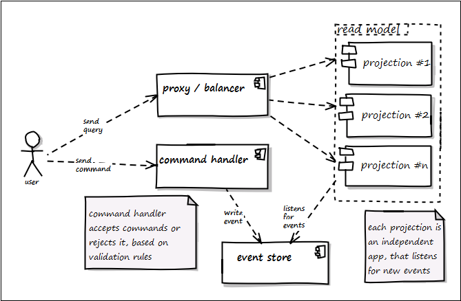
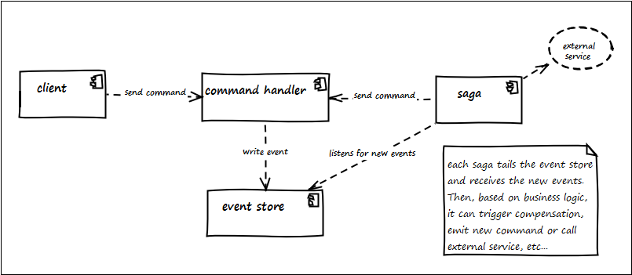

[](https://github.com/egetman/jes/actions)


[](https://search.maven.org/search?q=g:%22store.jesframework%22%20AND%20a:%22jes-core%22)
# Jes 
###### Strongly inspired by:
* [Versioning in an Event Sourced System](https://leanpub.com/esversioning) by Greg Young
* [The dark side of event sourcing: Managing data conversion](https://ieeexplore.ieee.org/document/7884621) by Michiel Overeem, Marten Spoor & Slinger Jansen 

---
Jes is a framework to build robust, event-driven microservices in a CQRS & ES paradigm.
Jes provides several abstractions, that help to organize the workflow of your application, and hide all the mess.

---
## Getting started

#### Prerequisites
1) `java 8`
2) build tool like `maven` or `gradle`

You can start using `Jes` by simply adding the following dependency into your pom file:
```xml
<dependency>
    <groupId>store.jesframework</groupId>
    <artifactId>jes-core</artifactId>
    <version>${jes.version}</version>
</dependency>
```

#### [Spring Boot Jes Demo](demo/readme.md)

#### Building from source
```shell script
git clone https://github.com/egetman/jes.git
cd jes
mvn install -DskipTests
```

## Overview
There are some typical patterns for mainstream apps for which Jes is perfect:

1) **webapps with lots of user interaction**

    

    - a user interacts with the system via queries and commands
    - queries are read-only
    - commands can be accepted or rejected when received by command handlers
    - command handler uses optimistic locking when writing events
    - each projection tails the event store and processed new events if needed

2) **event-driven apps with lots of automatic processing**
    
     
    
    - client emits commands to process
    - commands can be accepted or rejected when received by command handlers
    - command handler can use optimistic locking when writing events
    - each saga tails the event store and processed new events if needed: it can trigger compensation action via
     command, trigger new business logic via command or call an external service
    - sagas are distributed components with proper sync
    - sagas can be stateless or stateful. When stateful - state shared between all instances and all state changes
     use optimistic locking
    - stateful saga is an event-sourced saga 
    
3) **hybrid apps, which combines 1 & 2 types in some proportion** 

## Features
Feature | Seubsection | Description
--------|-------------|-------------
event stream corrections | | what to do if something goes wrong?
&#xfeff;| event stream split | it can be useful when you need, for example, split event stream for the anonymous one and another, that contains clients personal data
&#xfeff;| event stream merge | as a split, it can be useful when you want to combine different streams 
&#xfeff;| event stream deletion | optional operation. You can use it when, for example, you need to delete all user-related information, that bounded to a specific stream
&#xfeff;| copy-and-replace | you can read about it [here](https://leanpub.com/esversioning/read#leanpub-auto-simple-copy-replace)
versioning | | how your system will evolve?
&#xfeff;| multiple event versions | you can live with several concurrent event versions
&#xfeff;| upcasting | if you want to handle 'always last' version of an event - upcast it (from the 'raw' representation - no intermediate representations, you better know how to transform your data)
&#xfeff;| copy-and-transform event store | you can read about it [here](https://leanpub.com/esversioning/read#leanpub-auto-copy-transform)
core | | 
&#xfeff;| tails directly event store: no more unreliable event publishing | you can watch this [talk](https://youtu.be/I3uH3iiiDqY?t=2410) by Greg Young if you want to ask 'why?'
&#xfeff;| strong/weak schema formats (partial) | there are several formats you can use for the event store
&#xfeff;| pull-based projectors | there is no 'control communication channel' - each projection is independent, you can change it how you like
&#xfeff;| snapshotting | have a long event stream? It's not a problem
flow | | 
&#xfeff;| optimistic locking | perfect for user-related communication


## Jes basics
Central library element is `JEventStore`. It provides basic functionality for managing events in your system:

```java
public class JEventStore {
    public JEventStore(@Nonnull StoreProvider provider) {
    	...
    }
    
    public Stream<Event> readFrom(long offset) {...}
    public Collection<Event> readBy(@Nonnull UUID uuid) {...}
    // etc...
}
```
`StoreProvider` is an actual component that incapsulates all interaction with concrete store.  
Currently `StoreProvider` can be built on top of the database.  
There are 2 implementations of `StoreProvider` to use: `JdbcStoreProvider` & `JpaStoreProvider`:

```java
public class JdbcStoreProvider<T>... {
    public JdbcStoreProvider(@Nonnull DataSource dataSource, @Nonnull Class<T> serializationType,
                             @Nonnull SerializationOption... options) {
}

public class JpaStoreProvider<T>... {
    public JpaStoreProvider(@Nonnull EntityManagerFactory entityManagerFactory, @Nonnull Class<T> serializationType, 
                            @Nonnull SerializationOption... options) {
}
```

`serializationType` can be `String.class` or `byte[].class`, which will create json / binary serializers implemented
 on top of Jackson / Kryo respectively.

To work with `Aggregates` you can use `AggregateStore`:

```java
public class AggregateStore { 
    
    public AggregateStore(@Nonnull JEventStore eventStore) {...}
    public AggregateStore(@Nonnull JEventStore eventStore, @Nonnull SnapshotProvider snapshotProvider) {...}

    public <T extends Aggregate> T readBy(@Nonnull UUID uuid, @Nonnull Class<T> type) {...}
    
    // etc...
}
```

If `SnapshotProvider` specified, aggregate fetching is snapshotted.

`SnapshotProvider` can be any of `NoopSnapshotProvider`, `InMemorySnapshotProvider`, `JdbcSnapshotProvider`, 
`RedisSnapshotProvider`.

There is also basic support for projectors via:
```java
public abstract class Projector extends Reactor { 
    public Projector(@Nonnull JEventStore store, @Nonnull Offset offset, @Nonnull Lock lock) {...}
}
```

To make it work - extend it and mark the needed methods with `@ReactsOn` annotation:
```java
@ReactsOn
private void handle(@Nonnull SmthHappend event) {
    ...
}
```

## Usage
If you are familiar with `Spring`, the typical configuration of `Jes` may look like:
```java
@Configuration
@EnableAutoConfiguration
public class JesConfig {

    @Bean
    public StoreProvider jdbcStoreProvider(DataSource dataSource) {
        return new JdbcStoreProvider<>(dataSource, String.class);
    }

    @Bean
    public JEventStore eventStore(StoreProvider storeProvider) {
        return new JEventStore(storeProvider);
    }

    @Bean
    public SnapshotProvider snapshotProvider() {
        return new InMemorySnapshotProvider();
    }

    @Bean
    public AggregateStore aggregateStore(JEventStore eventStore, SnapshotProvider snapshotProvider) {
        return new AggregateStore(eventStore, snapshotProvider);
    }

    @Bean
    public Offset offset() {
        // you can use RedisOffset if you use Redis
        return new InMemoryOffset();
    }

    @Bean
    public Lock lock() {
        // you can use RedisReentrantLock if you use Redis
        return new InMemoryReentrantLock();
    }

    @Bean
    public Projector userProjector(JEventStore eventStore, Offset offset, Lock lock) {
        return new UserProjector(eventStore, offset, lock);
    }
}

```

## Todo:
 - version caching? to avoid every-write check
 - snapshots invalidation: describe or reimplement
 - store structure validation on start
 - ~~event idempotency on read (clustered environment)~~ done by locking for projectors
 - string (xml) serializer (xstream?): use SerializationOption to specify type?
 - upcasting
 - lazy transformation
 - ~~verify serialization/deserialization of abstract classes/interface references~~
 - ~~don't fail on unknown events~~ done via common event type for unregistered events
 - make reactors pull-mechanism customisable (for db CDC?)
 - ~~add demo app~~
 - ~~add InMemoryStoreProvider (H2 or just collections?) for testing && H2 support~~ 
 
 ###### PRs are welcome